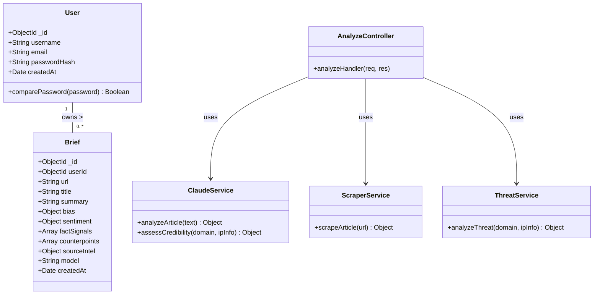
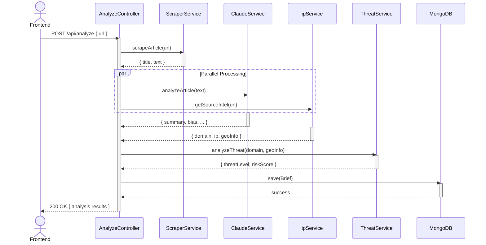
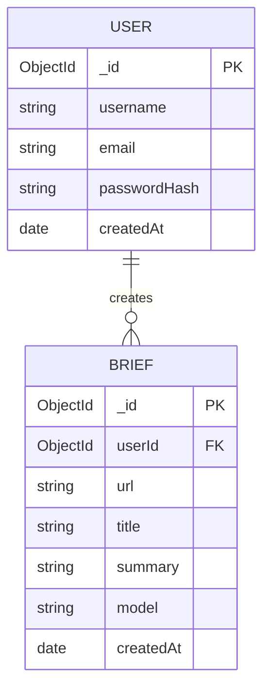
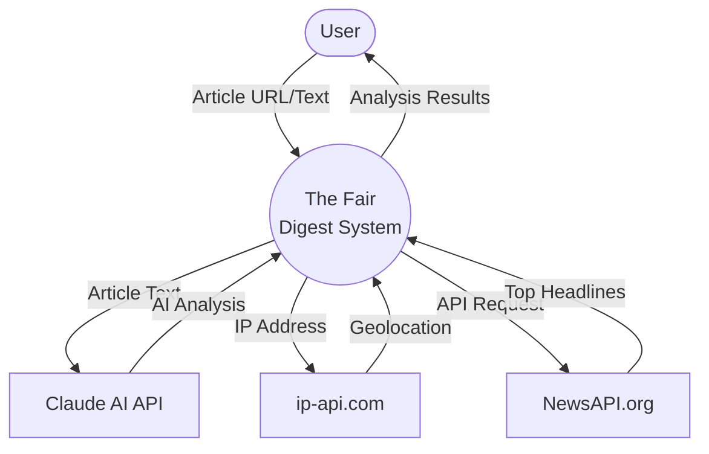

# The Fair Digest — UML Diagrams

This document contains Mermaid-based UML diagrams for the Software Engineering project report.

## 1. Use Case Diagram

```mermaid
usecaseDiagram
  actor User as "User"
  actor Admin as "Admin"
  
  rectangle "The Fair Digest System" {
    usecase UC1 as "Register / Login"
    usecase UC2 as "Submit Article URL"
    usecase UC3 as "Paste Article Text"
    usecase UC4 as "View Analysis Results"
    usecase UC5 as "View Past Briefs"
    usecase UC6 as "View Today's Wire"
  }
  
  User --> UC1
  User --> UC2
  User --> UC3
  User --> UC4
  User --> UC5
  User --> UC6
```

## 2. Class Diagram



## 3. Sequence Diagram (Article Analysis Flow)



## 4. Entity-Relationship (ER) Diagram



## 5. Data Flow Diagram (DFD) Level 0


